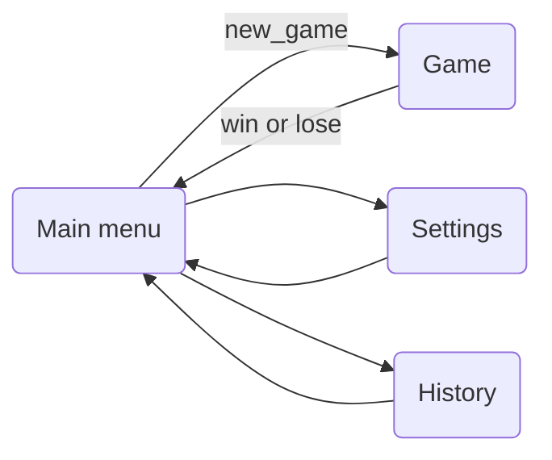
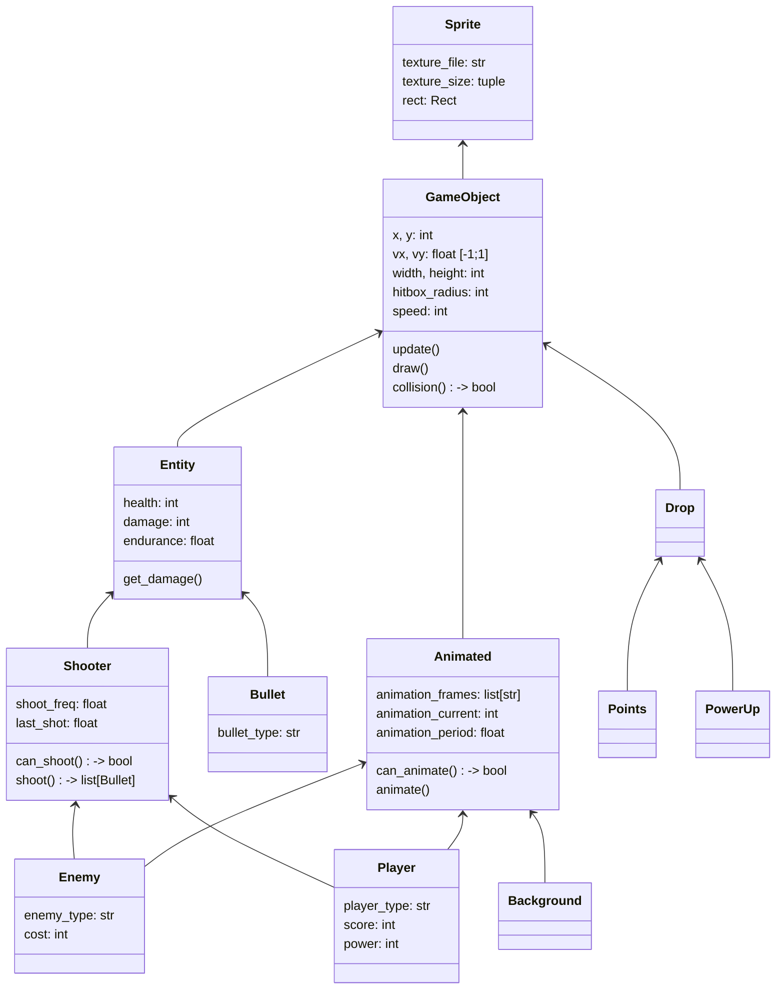
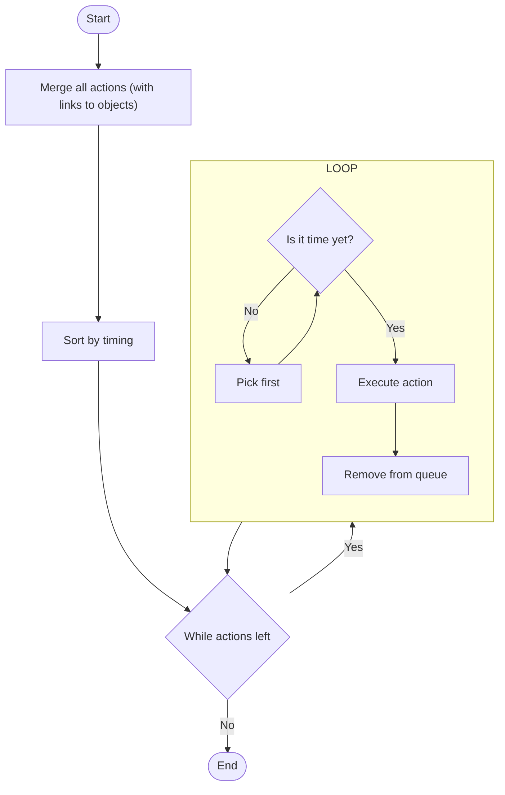
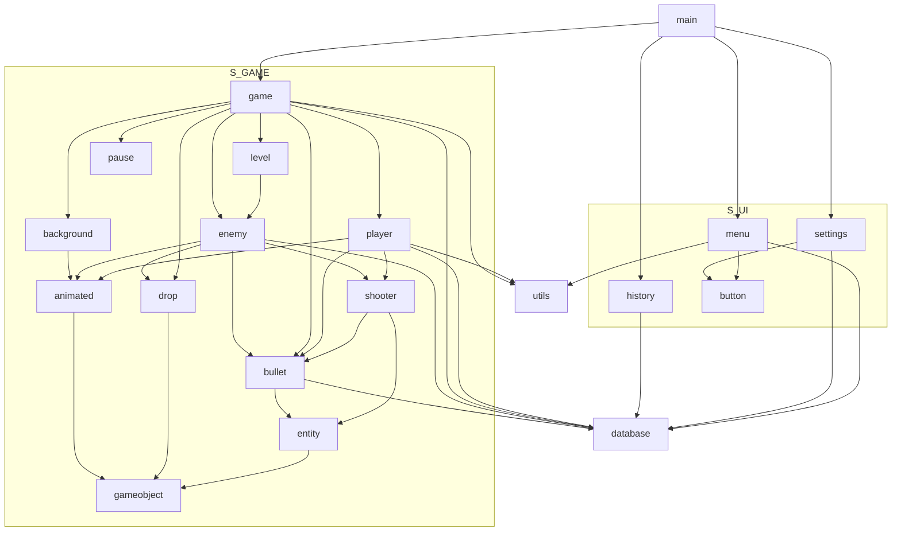

# Game mechanics, or how everything works (for devs)

## Structure

- danmaku (Runner)
  - Main menu (Scene)
  - Game field (Scene)
    - Player
    - Enemies

## Player movement

```
     -1
      ^
      |
-1 <- 0 -> 1
      |
      v
      1
```

Player has two axis (x, y) which vary from -1 to 1.
Player also has speed module (pixels / second).
Player's move distance calculation is (speed module) _ (axis) _ (time delta)

## Scenes



As we can see, all other scenes return to the main menu

## Position, hitboxes

Position of an object is a position of it's center point

_placement:_

```
/-----\
|     |
|  *  |
|     |
\-----/
```

(where the star is at)

**NOT** coordinates of left top corner

_wrong placement:_

```
*-----\
|     |
|     |
|     |
\-----/
```

## Classes



## Enemies' actions processing



## File hierarchy (import diagram)

<details>
  <summary>Old</summary>

  ```mermaid
  %%{init: {"flowchart": {"curve": "basis"}} }%%
  graph TB

  GAME("game.py")
  MAIN("main.py")


  animated --> gameobject

  background --> animated

  bullet --> entity
  bullet --> database

  button

  drop --> gameobject

  enemy --> shooter
  enemy --> database
  enemy --> animated
  enemy --> bullet
  enemy --> drop

  entity --> gameobject

  GAME --> enemy
  GAME --> player
  GAME --> level
  GAME --> database
  GAME --> drop
  GAME --> background
  GAME --> pause
  GAME --> utils
  GAME --> bullet

  gameobject

  history --> database

  level --> enemy

  MAIN --> GAME
  MAIN --> menu
  MAIN --> settings
  MAIN --> history

  menu --> background
  menu --> button
  menu --> database
  menu --> utils

  pause

  player --> shooter
  player --> database
  player --> animated
  player --> bullet
  player --> utils

  settings --> button
  settings --> database


  shooter --> entity
  shooter --> bullet

  utils

  subgraph S_UI
  direction TB
  end

  subgraph S_GAME
  direction TB
  end

  ```

</details>

---

<details open>
<summary>New</summary>



</details>
