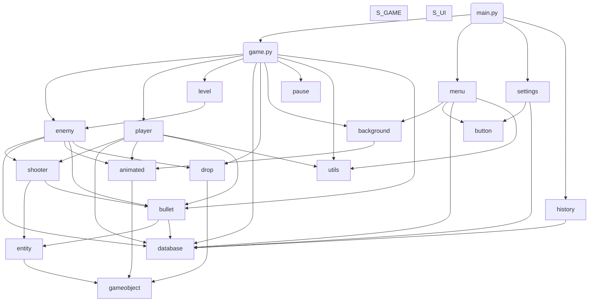

# Game mechanics, or how everything works (for devs)

## Structure

- danmaku (Runner)
  - Main menu (Scene)
  - Game field (Scene)
    - Player
    - Enemies


## Player movement
```
     -1
      ^
      |
-1 <- 0 -> 1
      |
      v
      1
```
Player has two axis (x, y) which vary from -1 to 1.
Player also has speed module (pixels / second).
Player's move distance calculation is (speed module) * (axis) * (time delta)


## Scenes


As we can see, all other scenes return to the main menu


## Position, hitboxes


Position of an object is a position of it's center point

*placement:*
```
/-----\
|     |
|  *  |
|     |
\-----/
```
(where the star is at)

**NOT** coordinates of left top corner

*wrong placement:*
```
*-----\
|     |
|     |
|     |
\-----/
```

## Classes


## Enemies' actions processing


## File hierarchy (import diagram)




