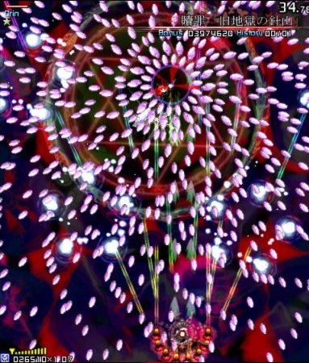

<!-- _footer: 2024 Сёмин В., Шелковкина М. -->

# Danmaku

##### Проект на Python с использованием PyGame

---

# Введение

Цель проекта: Создать игру, которая будет:

<div style="text-align:left;">
  <li>Использовать функционал PyGame</li>
  <li>Хранить все параметры в базе данных</li>
  <li>Иметь возможность сохранения</li>
  <li>Иметь текстуры, звуки</li>
</div>

---

<div>

Для создания игры был выбран жанр аркадных игр, "классический вертикальный Данмаку-шутер".
Также известный, как Bullet hell.



</div>

---

Похожие игры: Серия игр "Touhou Project", "Batsugun";
Игры со схожими механиками боя: "Undertale", "Enter the Gungeon"

---

## Архитектура

Разработка велась в 2-х направлениях: 
1. создание движка для удобной работы
2. создание игровых механик

---

## 1. 'Движок'

Получил название "VGame", написан поверх PyGame.
Разделяет игру на отдельные треды.
Создает абстракцию и интерфейс, подобный Love2D

git: https://github.com/virashu/pygametest

---

Устроен так:

```python
from vgame import Scene, Runner

class MyGame(Scene):
    def load(self):
      # actions before game loads

    def update(self):
      # update loop
      # + self.delta

    def draw(self):
      # draw loop
      # + self.graphics

    def exit(self):
      # actions before exit

Runner().run(
    MyGame(width=800, height=600, framerate=120, tickrate=120, title="Game")
)
```

---

## 2. Непосредственно игра

Каждый объект на поле - GameObject

---

---

## Спасибо за внимание!

## Прошу задавать вопросы
